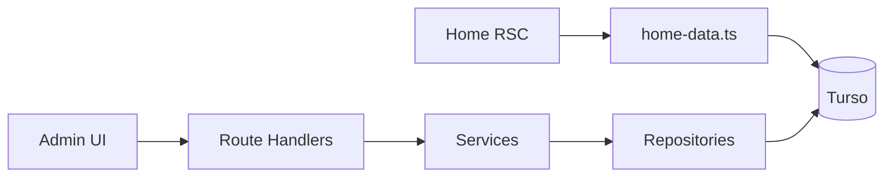

# Mamute

Digital menu and admin panel for an ice cream shop.

[Português](README.md) · [English](README.en.md)

[](https://nextjs.org/)
[](https://www.typescriptlang.org/)
[](https://turso.tech/)
[](https://www.better-auth.com/)

The app lives in [`cardapio/`](cardapio/). The home page is public; `/admin` requires a signed-in user.

## About

This system is an online menu: customers browse products, prices, and whether the shop is open. Staff manage the catalog, opening hours, and users from an authenticated dashboard.

## Features

### Public site (`/`)

- Active categories, subcategories, and products
- Retail and wholesale prices
- Product image
- Shop name, logo, and hero image
- Opening hours and an open/closed indicator
- No authentication

Data is loaded on the server ([`cardapio/src/lib/home-data.ts`](cardapio/src/lib/home-data.ts)) and passed down as props. Switching subcategory in the UI does not hit the database again.

### Admin (`/admin`)

- Sign-in at `/auth/login` (username and password). Public sign-up is disabled
- `/admin` routes guarded by middleware
- Inactive users cannot sign in
- Roles `admin` and `manager`
- Dashboard shortcuts
- CRUD for categories, subcategories, products, and users
- Store hours
- Store details (brand, logo, and hero), with Cloudinary uploads
- Overlay drawer navigation on mobile

List pages query the database in the page itself. Create and update go through the API.

## Stack

| Layer | Technology |
| --- | --- |
| App | Next.js 16 (App Router), React 19, TypeScript |
| UI | CSS Modules, Lucide |
| Database | Turso (SQLite), Drizzle ORM |
| Auth | Better Auth |
| Validation | Zod |
| Images | Cloudinary |

## Architecture

There are two data paths.

**Menu (read):** Server Component → `home-data.ts` → Turso.

**Admin (write):** UI → Route Handler → Service → Repository → Turso. Handlers validate with Zod and call services; business rules live in services; SQL lives in repositories.



## Getting started

Requirements: Node.js 20+ and a [Turso](https://turso.tech/) database. Image uploads in admin also need a [Cloudinary](https://cloudinary.com/) account.

```bash
git clone <repository-url>
cd cardapio
cp .env.example .env.local
```

Fill in `.env.local`:

| Variable | Purpose |
| --- | --- |
| `TURSO_DATABASE_URL` | Turso database URL |
| `TURSO_AUTH_TOKEN` | Turso access token |
| `BETTER_AUTH_SECRET` | Session secret (random string) |
| `BETTER_AUTH_URL` | Public app URL (`http://localhost:3000` in dev) |
| `CLOUDINARY_CLOUD_NAME` | Cloudinary cloud name |
| `CLOUDINARY_API_KEY` | API key |
| `CLOUDINARY_API_SECRET` | API secret |

```bash
npm install
npm run db:migrate
npm run db:seed-admin
npm run dev
```

Home: [http://localhost:3000](http://localhost:3000). Admin: [http://localhost:3000/admin](http://localhost:3000/admin).

## Scripts

Run these from `cardapio/`:

| Script | Purpose |
| --- | --- |
| `npm run dev` | Development server |
| `npm run build` | Production build |
| `npm run start` | Serve the production build |
| `npm run lint` | ESLint |
| `npm run db:generate` | Generate Drizzle migrations |
| `npm run db:migrate` | Apply migrations |
| `npm run db:studio` | Drizzle Studio |
| `npm run db:seed-admin` | Create the first admin user |
| `npm run db:seed-menu` | Seed menu data |
| `npm run db:seed-store` | Seed store settings |

## Layout

```
cardapio/
├── drizzle/              schema and migrations
├── scripts/              seeds
└── src/
    ├── app/              routes (home, admin, login, API)
    ├── components/home/  public menu
    ├── components/admin/ admin chrome
    ├── lib/              auth, database, home-data, hours
    ├── middleware/       session checks for APIs and pages
    ├── repositories/     database access
    ├── services/         business rules
    └── validations/      Zod schemas
```

## Limitations

- List `GET` endpoints for categories, products, subcategories, and users still return `501`. Admin list screens do not use them.
- API delete exists only for products.
- Some files under `src/components/public` and hooks (`use-menu`, `use-store-status`) are still stubs and are unused by the current UI.

## Roadmap

- Cart and orders
- WhatsApp integration
- Inventory
- Menu search
- Product detail modal
- Promotions
- Finer-grained permissions
- Stats dashboard
- Multiple stores
