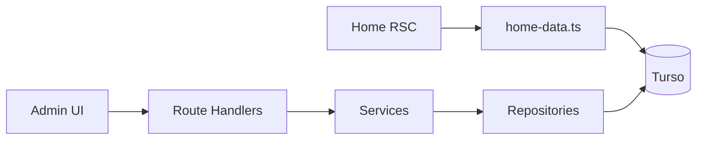

# Mamute

Cardápio digital e painel administrativo para sorveteria.

[Português](README.md) · [English](README.en.md)

[](https://nextjs.org/)
[](https://www.typescriptlang.org/)
[](https://turso.tech/)
[](https://www.better-auth.com/)

A aplicação fica em [`cardapio/`](cardapio/). A home é pública; o painel em `/admin` exige login.

## Sobre

O **Mamute** é um cardápio online: o cliente consulta produtos, preços e se a loja está aberta. Quem administra o catálogo, os horários e os usuários entra pelo painel autenticado.

## Funcionalidades

### Área pública (`/`)

- Categorias, subcategorias e produtos ativos
- Preço de varejo e de atacado
- Imagem do produto
- Nome, logo e imagem de destaque da loja
- Horários de funcionamento e indicador de aberto/fechado
- Sem autenticação

Os dados são carregados no servidor ([`cardapio/src/lib/home-data.ts`](cardapio/src/lib/home-data.ts)) e enviados por props até a interface. Trocar de subcategoria na tela não dispara nova consulta ao banco.

### Área administrativa (`/admin`)

- Login em `/auth/login` (usuário e senha). Cadastro público desligado
- Rotas `/admin` protegidas por middleware
- Usuários inativos não entram
- Papéis `admin` e `manager`
- Dashboard com atalhos
- CRUD de categorias, subcategorias, produtos e usuários
- Horários da loja
- Informações da loja (marca, logo e hero), com upload via Cloudinary
- Menu lateral em drawer no celular

As listagens leem o banco nas próprias páginas. Criar e editar passam pela API.

## Stack

| Camada | Tecnologia |
| --- | --- |
| App | Next.js 16 (App Router), React 19, TypeScript |
| UI | CSS Modules, Lucide |
| Banco | Turso (SQLite), Drizzle ORM |
| Auth | Better Auth |
| Validação | Zod |
| Imagens | Cloudinary |

## Arquitetura

Há dois caminhos de dados.

**Cardápio (leitura):** Server Component → `home-data.ts` → Turso.

**Admin (escrita):** UI → Route Handler → Service → Repository → Turso. Os handlers validam com Zod e chamam os services; regras de negócio ficam nos services; SQL fica nos repositories.



## Começando

Requisitos: Node.js 20+ e um banco [Turso](https://turso.tech/). Upload de imagens no admin também precisa de uma conta [Cloudinary](https://cloudinary.com/).

```bash
git clone <url-do-repositorio>
cd cardapio
cp .env.example .env.local
```

Preencha o `.env.local`:

| Variável | Uso |
| --- | --- |
| `TURSO_DATABASE_URL` | URL do banco Turso |
| `TURSO_AUTH_TOKEN` | Token de acesso Turso |
| `BETTER_AUTH_SECRET` | Segredo da sessão (string aleatória) |
| `BETTER_AUTH_URL` | URL pública da app (`http://localhost:3000` em dev) |
| `CLOUDINARY_CLOUD_NAME` | Cloud da Cloudinary |
| `CLOUDINARY_API_KEY` | Chave da API |
| `CLOUDINARY_API_SECRET` | Segredo da API |

```bash
npm install
npm run db:migrate
npm run db:seed-admin
npm run dev
```

A home fica em [http://localhost:3000](http://localhost:3000). O painel, em [http://localhost:3000/admin](http://localhost:3000/admin).

## Scripts

Executar de dentro de `cardapio/`:

| Script | Função |
| --- | --- |
| `npm run dev` | Servidor de desenvolvimento |
| `npm run build` | Build de produção |
| `npm run start` | Sobe o build |
| `npm run lint` | ESLint |
| `npm run db:generate` | Gera migrations Drizzle |
| `npm run db:migrate` | Aplica migrations |
| `npm run db:studio` | Drizzle Studio |
| `npm run db:seed-admin` | Cria o primeiro usuário admin |
| `npm run db:seed-menu` | Dados iniciais de cardápio |
| `npm run db:seed-store` | Dados iniciais da loja |

## Estrutura

```
cardapio/
├── drizzle/              schema e migrations
├── scripts/              seeds
└── src/
    ├── app/              rotas (home, admin, login, API)
    ├── components/home/  cardápio público
    ├── components/admin/ layout do painel
    ├── lib/              auth, banco, home-data, horários
    ├── middleware/       sessão nas APIs e páginas
    ├── repositories/     acesso ao banco
    ├── services/         regras de negócio
    └── validations/      schemas Zod
```

## Limitações

- `GET` de listagem em categorias, produtos, subcategorias e usuários ainda responde `501`. As telas de lista não usam esses endpoints.
- Exclusão via API existe só para produtos.
- Alguns arquivos em `src/components/public` e hooks (`use-menu`, `use-store-status`) ainda são stubs e não entram na UI atual.

## Roadmap

- Carrinho e pedidos
- Integração com WhatsApp
- Controle de estoque
- Pesquisa no cardápio
- Modal de detalhes do produto
- Promoções
- Permissões mais granulares
- Dashboard com estatísticas
- Múltiplas lojas
